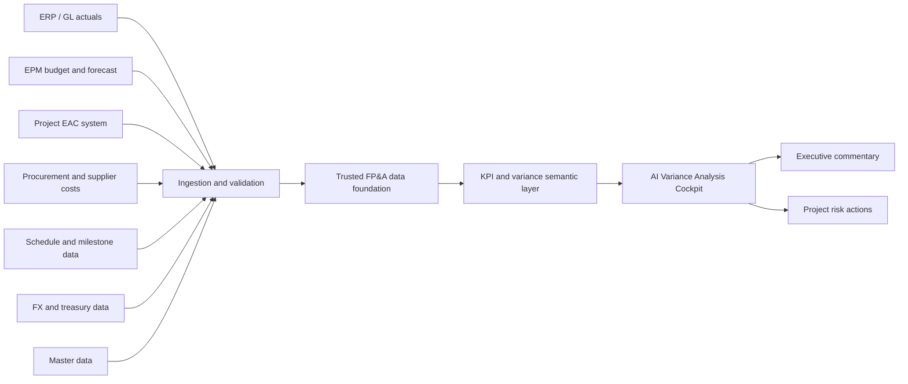
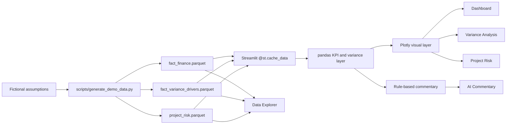

# AI Variance Analysis Cockpit

Fictional FP&A variance analysis demo for **Nippon Advanced Heavy Industries**.

Presentation theme:

**AI活用の前に整えるべきFP&Aデータ基盤**

The client-facing story is aimed at CFO, corporate planning, and FP&A audiences.
The demo is used to show why management explanation and decision-making require a trusted FP&A data foundation before AI commentary can be operationally reliable.

[Dashboard/client app](https://heavy-industry-ai-demo-client.streamlit.app/)

[Full app](https://heavy-industry-ai-demo-6apcskxwufgremlq9bivhk.streamlit.app/)

Deploy targets:

- Dashboard/client app: `client_app.py`
- Presenter/support app: `presenter_app.py`
- Internal information app: `app.py`

- Demo data only
- All figures are fictional
- No real company financial data is used

## Current Status

- Demo data generated at **2026-06-22 16:56:49 JST**
- Current generated row count: **225,160 rows**
- FY2026 total story: revenue is **+JPY 192.9bn vs Budget**, while operating profit is **-JPY 298.8bn**, margin is **-6.3pt**, and cash flow is **-JPY 341.8bn**
- Current risk queue: **11 Critical**, **32 High**, and **37 loss-risk** projects

## Setup

```bash
pip install -r requirements.txt
python scripts/generate_demo_data.py
streamlit run app.py
```

Open the app at:

```text
http://localhost:8501
```

## Demo Flow

The app separates usage modes by deployment target:

- **Dashboard/client app**: only the cockpit screens a client can display and touch.
- **Presenter/support app**: briefing, data foundation, reference architecture, follow-up, and support pages shown by us.
- **Internal information app**: presentation materials and demo information; it does not show the client cockpit pages.

Dashboard/client app:

1. **Dashboard**: Show the executive story: revenue is above plan, while operating profit, margin, and cash flow deteriorate.
2. **Profitability Race**: Show animated operating profit margin rankings by segment or project, including margin gap vs Budget.
3. **Variance Analysis**: Select period, segment, KPI, and comparison type; explain the waterfall and top drivers.
4. **Project Risk**: Highlight Critical Marine & Offshore projects and High Aerospace & Defense projects.
5. **AI Commentary**: Generate Japanese FP&A comments for management meeting materials.

Presenter/support app:

- **Client Preview**: Frame the discussion as FP&A data foundation readiness, not an AI tool demo.
- **Data Foundation**: Explain why trusted FP&A data is the prerequisite for management-ready AI commentary.
- **Reference Architecture**: Explain implementation options from the management explanation flow backward.
- **Client Follow-up**: Move into FP&A data foundation assessment and PoC scoping.
- **デモ解説用 / Presenter Guide**: Internal talk track, Q&A, and wording guardrails.
- **技術構成 / Tech Architecture**: Slide-style internal page explaining how the demo is built, operated, and extended.
- **Data Explorer**: Inspect generated fictional data, row counts, columns, samples, and statistics.

## Recommended Next Steps

| Priority | Theme | Action | Output |
|---|---|---|---|
| 1 | Client message | Lead with FP&A data foundation readiness before the demo | CFO/FP&A opening talk track |
| 2 | Demo script | Operate Dashboard -> Variance Analysis -> Project Risk -> AI Commentary as one management explanation flow | Mid-demo talk track |
| 3 | Assessment CTA | Convert the demo into FP&A data foundation assessment next steps | Assessment agenda |
| 4 | Data credibility | Document fictional assumptions, data grain, KPI definitions, and variance logic | Data definition slide |
| 5 | Deployment | Push to GitHub and deploy on Streamlit Community Cloud | Shareable demo URL |

## Data Foundation Message

The central point of this demo is not that AI can write variance comments.
The more important message is that CFO, corporate planning, and FP&A teams need a trusted data foundation to explain causes, impacts, and actions in management meetings.

ERP actuals, EPM budget and forecast data, project EAC, procurement costs, schedule milestones, FX data, and master data must be reconciled and governed before AI can produce reliable management commentary.



Required quality gates:

- Reconcile FP&A totals with ERP and GL.
- Lock scenario versions such as Budget, Previous Forecast, and Latest Forecast.
- Map project IDs, departments, segments, accounts, and customers consistently.
- Align monthly, quarterly, and annual grains.
- Preserve data lineage so AI comments can be traced back to source facts.

## Technical Architecture



## Data

`python scripts/generate_demo_data.py` creates:

- `data/fact_finance.parquet`
- `data/fact_variance_drivers.parquet`
- `data/project_risk.parquet`
- `data/dim_projects.parquet`
- `data/demo_metadata.json`

Current generated row count is **225,160 rows**.
